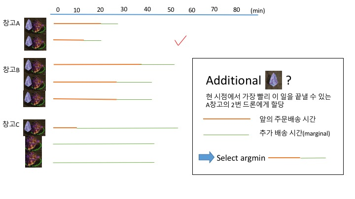

# 풀이 idea  

## 1. 주문을 순서대로 처리  
매 주문이 들어올때 마다 추가(marginal) 배송시간을 최소화 하는 결정  
greedy algorithm  
단 주문 순서에 따라 총 배송시간이 달라짐(실험: random.shuffle())  
최종 결과는 각 창고별로 가장 소요시간이 긴 드론  
매 주문이 들어올때마다 최적의 결정을 내린다고 전체 시간을 최적화할 수 있을까?  
order list를 '적당히' shuffle하면 더 나은 결과를 얻을 수 있음(각 창고에서 가장 짧은 곳의 주문을 list의 앞쪽에)
  

## 2. 주문을 100개씩 한꺼번에 처리  
실제로는 한꺼번에 100개씩 묶어서 최적의 할당을 함    
100개 주문 내의 순서에 무관하게 최적 결정  
100개 주문을 ∑i*j 개 드론에 할당할때, 최적 분할을 찾는 문제  
minimax dron_schedule  
100개 주문을 3개 창고에 할당 후 창고 안에서 각 드론에 할당(greedy?)하는 방법은 문제를 더 복잡하게 함  
전체 경우의수 따지기 힘듬  
어떻게 구현해야 할지 잘 모르겠다  

## 3. greedy + reverse jenga  
main.py에서 최종 구현한 방법  
1번 방법을 끝낸 후에 시간이 가장 오래 걸리는 드론에 할당된 주문을 다른 드론에 넘기거나 교환하여 이 시간을 줄일 수 있는지 살펴본다  

# 소스코드 실행  
python3 main.py  

# 예제 input 생성  
python3 make_input.py  
